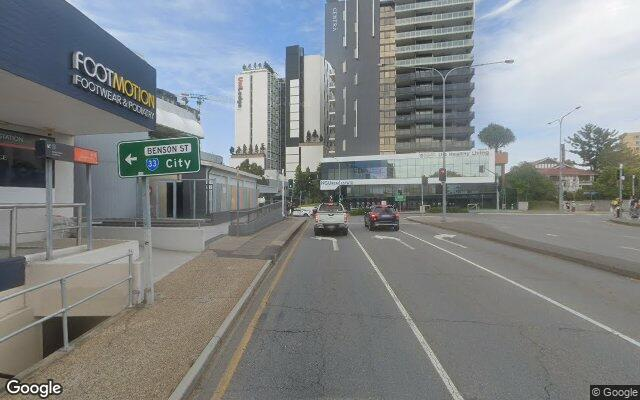

# NavBuddy

[](https://www.python.org/downloads/)
[](LICENSE)

A VLM benchmarking toolkit for autonomous navigation. NavBuddy generates street-level imagery datasets paired with turn-by-turn instructions, benchmarks **29 frontier and open-weight vision-language models** on navigation tasks, and provides human-verified ground-truth labels for action prediction, lane-change detection, and lane counting.

**[Benchmark leaderboard](https://aronbakes.github.io/navbuddy/)** | **[CLI Reference](docs/cli.md)** | **[Scoring](docs/scoring.md)**



## What it does

- **Dataset generation** — Given an origin and destination, NavBuddy routes via Google Maps, downloads Street View frames at configurable distances from each maneuver, renders OSM overhead maps, and enriches samples with road metadata from OpenStreetMap.
- **VLM benchmarking** — Run any model available on OpenRouter (Gemini, GPT, Claude, Grok, Qwen, etc.) against the dataset and score outputs on direction accuracy, lane-change F1, lane count, and BERTScore.
- **NavBuddy-100** — A 100-sample evaluation split across 30 routes in Brisbane, Sydney, Melbourne, and Canberra with human-verified ground-truth labels. 29 models evaluated across 4 input modalities. One command to download.

---

## Quick start

```bash
git clone https://github.com/AronBakes/navbuddy.git
cd navbuddy
pip install uv    # if you don't have uv
uv sync
source .venv/bin/activate
```

### Download NavBuddy-100

Requires a [Google Maps API key](https://console.cloud.google.com/apis/credentials) with **Street View Static API** enabled (~$0.70 for 100 frames).

```bash
navbuddy setup
```

### Run inference

```bash
navbuddy evaluate -d ./data/samples.jsonl -m google/gemini-3-flash-preview --data-root ./data -n 5
```

### Generate your own routes

```bash
# Route data only (no frames, ~$0.005)
navbuddy route -o "Sydney Opera House" -d "Bondi Beach"

# Full generation with Street View frames + overhead maps
navbuddy generate -o "Sydney Opera House" -d "Bondi Beach" -c sydney
```

---

## Documentation

| Doc | Contents |
|-----|----------|
| [CLI Reference](docs/cli.md) | All commands, flags, and examples |
| [API Keys](docs/api-keys.md) | Which Google APIs are needed, costs, setup |
| [Data Formats](docs/data-format.md) | Schemas for ground truth, results, routes, manifest |
| [Scoring](docs/scoring.md) | Direction groups, lane change F1, BERTScore |
| [Contributing](CONTRIBUTING.md) | Development setup, adding models, submitting results |

---

## Citation

```bibtex
@inproceedings{bakes2026navbuddy,
  author    = {Bakes, Aron and Nguyen, Tony and Elhenawy, Mohammed and Rakotonirainy, Andry},
  title     = {NavBuddy: An AI-Augmented Navigation Assistant for Context-Aware Route Guidance},
  booktitle = {2026 IEEE International Conference on Computing and Machine Intelligence (ICMI)},
  year      = {2026},
  note      = {to appear}
}
```

## License

MIT. See [LICENSE](LICENSE) for details.
